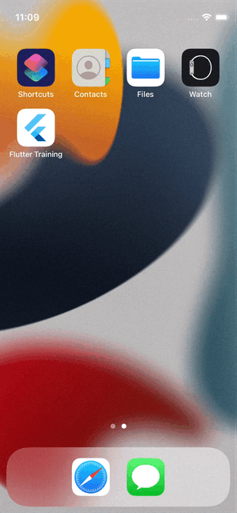
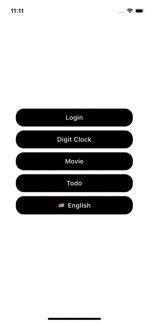
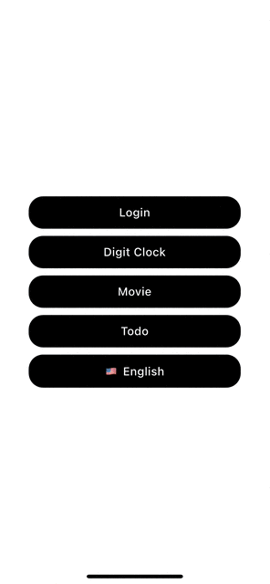

# 📱 Flutter Training App

### 📘 Onboarding
- Màn hình giới thiệu + Đăng nhập, đăng ký.


### ⏰ DigitClock
- Hiển thị đồng hồ theo dạng kỹ thuật số


### 🎞️ Movie
- `Danh sách phim`: Hiển thị danh sách phim từ API.
- `Chi tiết phim`: Hiển thị nội dung chi tiết của phim khi chọn.
<div style="display: flex; gap: 10px;">
  
  
</div>

### 🎞️ Todo
- `Danh sách Todo`: Hiển thị danh sách Todo (Đang làm, đã hoàn thành)
- `Thêm/Sửa/Chi tiết Todo`: Thêm, sửa, xem chi tiết Todo
- `Thông báo`: Thông báo ngoài/trong ứng dụng khi Todo đến giờ
<div style="display: flex; gap: 10px;">
  
  
  
</div>

### 📘 Localization
- Đa ngôn ngữ


---

## 🛠 Thông tin phiên bản

- Dart version: 3.8.1 
- Gen image, font:
```dart
dart run build_runner build --delete-conflicting-outputs
```
