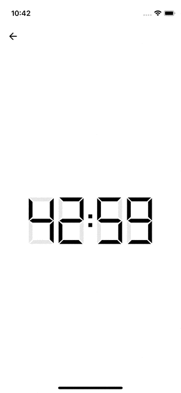

# 📱 Flutter Training App

### 📘 Onboarding
- Màn hình giới thiệu + Đăng nhập, đăng ký.


### ⏰ DigitClock
- Hiển thị đồng hồ theo dạng kỹ thuật số


### 🎞️ Movie
- `Danh sách phim`: Hiển thị danh sách phim từ API.
- `Chi tiết phim`: Hiển thị nội dung chi tiết của phim khi chọn.


---

## 🛠 Công nghệ sử dụng

-

---

## 🛠 Thông tin phiên bản

- Dart version: 3.8.1 
- Gen image, font:
```dart
dart run build_runner build --delete-conflicting-outputs
```